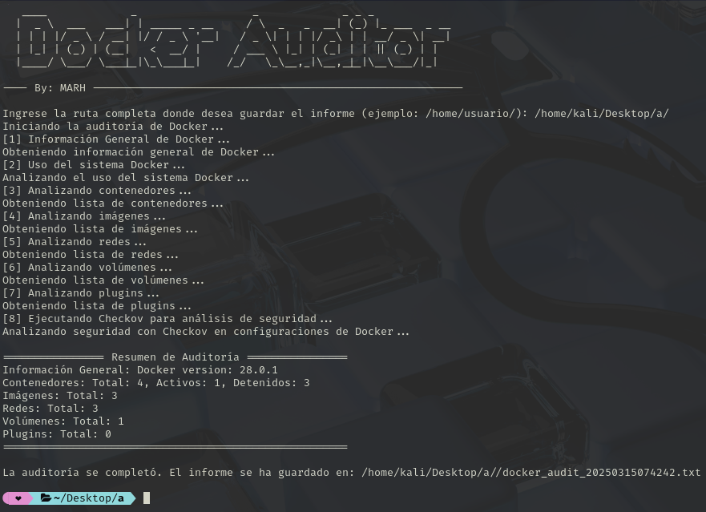

# DockerAuditor

**DockerAuditor** es una herramienta de auditoría forense para entornos Docker.
Este script en Bash recopila información detallada del entorno Docker en la máquina, incluyendo:

- **Información General:** Versiones, detalles del daemon y uso del sistema.
- **Contenedores:** Inspección completa, comando de inicio, logs (últimas 200 líneas) y, en lo posible, historial interno de comandos.
- **Imágenes:** Inspección completa e historial de construcción (docker history).
- **Redes, Volúmenes y Plugins:** Listado e inspección detallada.
- **Resumen Final:** Tabla con la versión de Docker y el total de contenedores, imágenes, redes, volúmenes y plugins.



## Requisitos

- Docker instalado y en ejecución.
- Shell Bash (disponible en la mayoría de distribuciones Linux).

## Instalación

1. Clona este repositorio o descarga el script `DockerAuditor.sh`:
```bash
git clone https://github.com/Mayky23/DockerAuditor.git
cd DockerAuditor
```
2. Asigna permisos de ejecución al script:
```bash
chmod +x DockerAuditor.sh
```
3. Uso
Ejecuta el script desde la terminal:
```bash
./DockerAuditor.sh
```
El script solicitará la ruta y nombre del archivo para guardar el informe de auditoría. Una vez completado, el informe estará disponible en el archivo especificado.